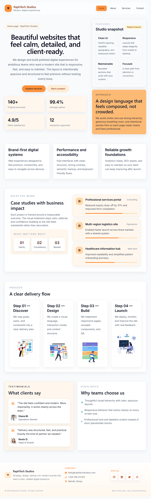
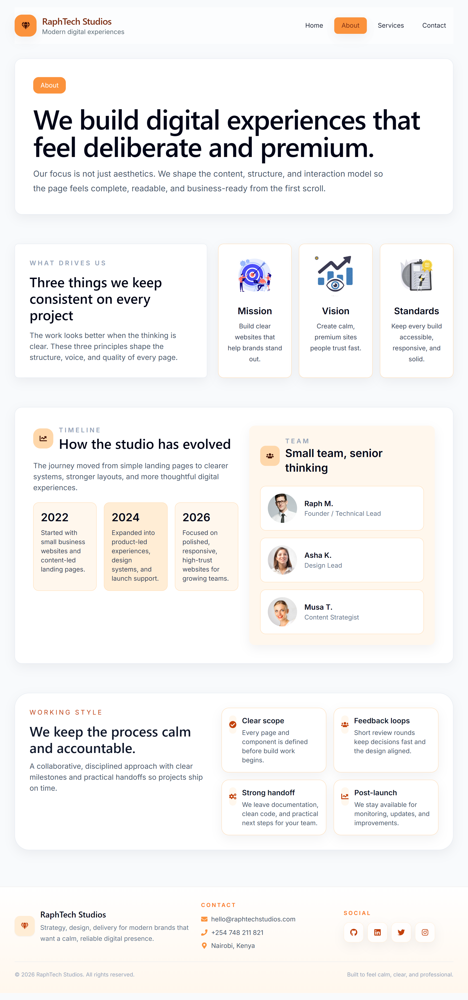
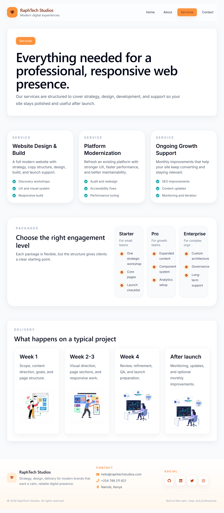
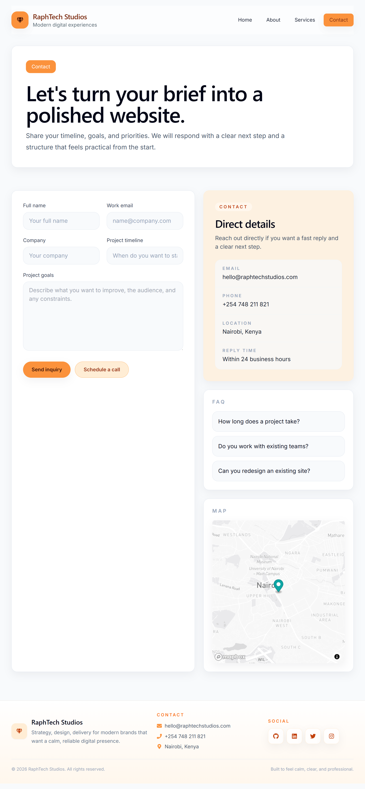
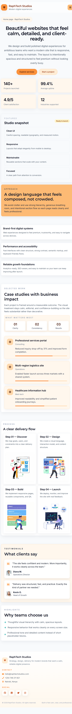
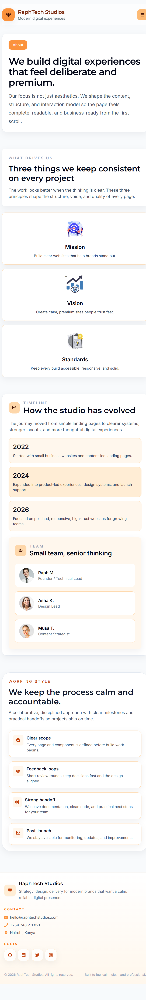
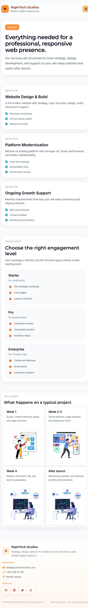
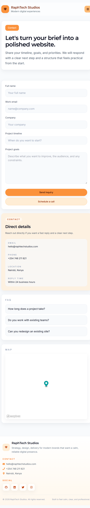

# React Multi-Page Website

A responsive React + Vite website for the Synent internship task. It presents a polished multi-page marketing experience with a home page, supporting pages, and contact-focused sections.

## Features

- Multi-page navigation for Home, About, Services, and Contact.
- Responsive header with a mobile hamburger menu.
- Hero, services, case study, testimonial, and FAQ sections.
- Contact page with map support powered by Mapbox GL.
- Reusable card-based layouts and icon-driven UI sections.
- Fast client-side rendering with Vite.

## Tech Stack

- React 18
- Vite
- Tailwind CSS
- Mapbox GL JS
- react-icons

## Project Structure

- `src/App.jsx` contains the main pages and shared UI.
- `src/index.css` contains the global styling and theme helpers.
- `src/main.jsx` boots the React app.

## Getting Started

1. Install dependencies:

```bash
npm install
```

2. Add a Mapbox token in a `.env` file:

```bash
VITE_MAPBOX_TOKEN=your_mapbox_token_here
```

3. Start the development server:

```bash
npm run dev
```

4. Build for production:

```bash
npm run build
```

## Notes

- If `VITE_MAPBOX_TOKEN` is missing, the map section shows a fallback message instead of crashing.
- The site is designed to work well on both desktop and mobile screens.

## Demo

Watch a short demo of the multipage site here:

- https://youtu.be/-XgQYWR_YUA

Screenshots used in the README and documentation are stored in the `screenshots` folder. Add image files there (PNG/JPG) and reference them from this README or other docs as needed.

## Screenshots

### Desktop

| Home | About | Services | Contact |
| --- | --- | --- | --- |
|  |  |  |  |

### Mobile

| Home | About | Services | Contact |
| --- | --- | --- | --- |
|  |  |  |  |
